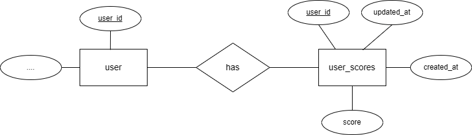
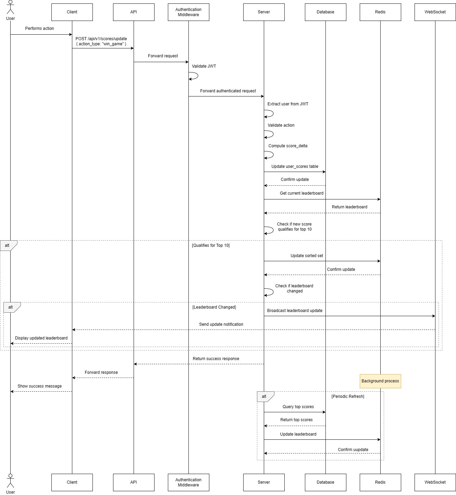

<!-- PROJECT LOGO -->
<br />
<div align="center">
  <h1 align="center">Scoreboard API Module Specification</h3>
</div>

<!-- ABOUT THE PROJECT -->
## About The Module
This document specifies the requirements for a backend API module responsible for managing the top 10 user's scores and updating the scoreboard in real-time. This module will be integrated into the 
existing website to provide a dynamic and secure scorekeeping system.

## Module Requirement
### Functional requirement:
- Save the scores of all users
- Provides a live-updating leaderboard displaying the top 10 users and their scores.
- Updates user scores when receiving authorized API calls from the website.
- Implements security measures to prevent unauthorized score manipulation.
### Non-functional requirement:
- Performance:
  - The module must load the list of the top 10 users and their scores in 2 seconds or less.
  - Update the score for the user in real-time
- Security:
  - The module needs to secure the updation score api

 ## Technology Stack
 Depending on the total number of users we can choose between using web socket or Kafka to achieve real-time updating for the scoreboard. Here I recommend using a web socket for three main reasons:
 - WebSockets are easier to implement and require less infrastructure than Kafka.
 - The number of users is limited so Kafka may be an overkill for this module.
 - WebSockets deliver updates only to connected clients interested in the scoreboard. With Kafka, messages might be sent to a broader audience depending on the topic configuration, potentially creating unnecessary processing.

Besides, for faster querying the list of top 10 users, there are two choices: in-memory data and cached database. Here I recommend using a cached database (Redis) for two main reasons:
- Scalability: Caches like Redis are designed for distributed environments and can be scaled horizontally (adding more servers) to handle an increasing user base or update volume. While, in-memory data is limited to the available memory of a single server, making it less scalable. In case later we want to save a list of the top 1000 users or other data, we do not need to change the system design.
- Centralized Management: Redis provides a central location for managing our top 10 list, helping us to access and monitor more easily.

## Requirements:
Here we need to save scores for all the users and also a separate table for saving the top 10 users for the scoreboard for faster query the first time get the scoreboard.
### Database design
#### User Scores Table:
- This table stores individual user scores and related data.
- Columns include:
  - user_id (unique identifier for the user)
  - score (current score of the user)
  - updated_at (timestamp of the last score update)
  - created_at (timestamp of the score created)
#### Index on Score column:
Here, to optimize the query we need to create a single index on the score column so that later when we want to get the top 10 list it will be faster.

<br />
<div align="center">
  
  <p>Diagram 1. Illustration database ERD</p>
</div>

### Authentication:
- All API requests require user authentication using a JSON Web Token (JWT) in the authorization header. The token must be valid and have the necessary permissions to access the requested endpoint.
- We need to implement the authorization checks on the server side to ensure that only authorized users can update scores. By parsing the JWT token, we can get the user_id and check if the user has enough rights
to update the score as well as whether the user score record exists or not. If the score record does not exist, we can create a new record for the user
- Here, I recommend creating a middleware on the gateway to parse the JWT token in the headers first, after that we can forward the request to the service with the user info for checking the right as well as
protecting the server.
### Error Codes:
The following error codes might be returned in the response body:

- 400 Bad Request: Invalid request body format or missing required parameters.
- 401 Unauthorized: Invalid or missing authorization token.
- 403 Forbidden: The user does not have permission to access the requested resource.
- 404 Not Found: Resource not found (e.g., a user with the provided ID doesn't exist).
- 500 Internal Server Error: Unexpected server error occurred.

### API Endpoints:
#### 1. GET /api/v1/scores/leaderboard
- Description: Retrieves the top 10 user scores and their corresponding user IDs.
- Success Response:
   ```
  {
    "data": [
      {
        "rank": 1,
        "user_id": 11,
        "score": 900
      },
      {
        "rank": 2,
        "user_id": 13,
        "score": 856
      },
      // ... (other top 10 entries)
    ]
  }
   ```
- Error Response: Refer to the error codes section above.

#### 2. POST /api/v1/scores/update
- Description: Updates a user's score upon completion of an action.
- Request Body:
  ```
  {
    "user_id": (integer),  // Unique identifier of the user
    "score_delta": (integer),  // Amount to increase the user's score
  }
   ```
- Success Response:
   ```
  {
    "message": "Score updated successfully"
  }
   ```
- Error Response: Refer to the error codes section above.

### Implement for API /api/v1/scores/update endpoint:

<br />
<div align="center">
  
  <p>Diagram 2. Illustration workflow of score updation</p>
</div>

In this API, we need to do two tasks:
- Update the score and top 10 scores in the cached database (Redis)
- Broadcast to all the users in case there is any change in the scoreboard list

#### 1. Update the score and scoreboard in the cached database (Redis)
##### Updating User Score:
- When a user completes an action triggering a score update:
  - Update the user's score in the user_scores Table.
##### Updating top 10 scores in Redis:
- After updating the User Scores table:
  - Check if the user's new score qualifies for the top 10 by combining the new score with the current lowest score in the Redis.
- If the new score qualifies for the top 10:
  - Update the Top 10 scores in Redis by updating the ranking or add a new score and remove the one that no longer qualifies for the top 10
- If the new score doesn't qualify for the top 10:
  - No further action is needed on the Redis.
 
#### *** Note ***
We need to ensure the cached top 10 list (Redis) remains consistent with the actual user scores stored in the database ("scores" table) by implementing Cache expiration and Updating the cache frequently.
1. Setting Cache Expiration in Redis
- Set an expiration time for the cached top 10 list in Redis. This ensures the cached data doesn't become old indefinitely.
2. Updating the cache frequently
- Implement a background job to periodically refresh the cached top 10 list with the latest data from the database before it expires.
- We should set a short expiration time for the cached top 10 list. This ensures more frequent updates from the background job, reducing the time users might see outdated data. (During the short period between cache expiration and the background job updating it, users might see slightly outdated data in the top 10 list)
#### 2. Broadcast to all the users in case there is any change in the scoreboard list
- Every time we receive an updation score from the user and this affects our scoreboard, we need to notify all the clients immediately to ensure real-time updation. To do this, I recommend using Websocket to send
messages to all the connected Web browsers.
- We can save all the active channels on the server and send the modified ranking scores to all the active users to update the Top 10 scores.
  

